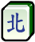

# Mahjong Series

## Introduction
Mahjong is based on draw-and-discard card games that were popular in 18th and 19th century China and some are still popular today.

In each deck, there are three different suits numbered 1 to 9, which are called Simple tiles. They are Circles (denoted by `[1-9]p`), Bamboo (denoted by `[1-9]s`), and Characters (denoted by `[1-9]m`).

Moreover, there is another suit named *Honor tiles*.

It includes Wind tiles (namely East, South, West, North, denoted by `[1-4]z`) and Dragon tiles (namely Red, Green, White, denoted by `[5-7]z`).

### Simple Suits

|Suit|Code|1|2|3|4|5|6|7|8|9|
|---:|:---:|:---:|:---:|:---:|:---:|:---:|:---:|:---:|:---:|:---:|
|Circles|p||||||||||
|Bamboo|s||||||||||
|Characters|m||||||||||

### Honor tiles

|Suit|Code|1 (East)|2 (South)|3 (West)|4 (North)|5 (Red)|6 (Green)|7 (White)|
|---:|:---:|:---:|:---:|:---:|:---:|:---:|:---:|:---:|
|Winds|z|||||
|Dragons|z| | | | ||||

**Note:** There are 4 identical copies of each kind of tiles in a deck.

## Gameplay & Winning

In each of Mahjong games, each of the 4 players around the table has 13 tiles. They take turns drawing a tile from the tile walls and then discarding one of the tiles from their hands. One wins the game if that player holds a defined combination of tiles.

### Regular Winning Hand
A regular winning hand consists of:
* 4 Melds
* 1 Pair.

#### Melds
Each meld of tiles can be 3 identical copies of a tile (e.g. `1p` `1p` `1p`, `2d` `2d` `2d`) or 3 consecutive tiles of a Simple suit (e.g. `6m` `7m` `8m` or `4s` `5s` `6s`).

| | | |
|---:|:---:|:---:|
|Copies|||
|| | |
|Runs|||

#### Example 
Here is an example of regular winning hands.

|Meld 1|Meld 2|Meld 3|Meld 4|Pair| |
|:---:|:---:|:---:|:---:|:---:|:---:|
||||||

### Other Winning Hands

There are some special combinations of tiles that also win you the game.

#### Seven-Pairs

One of them is called Seven-pairs. As the name suggests, it consists of 7 pairs, each consisting of 2 tiles with identical patterns.

One of winning hands with Seven-pairs is like the one shown below.

For the current task, we'll use MCR rules, so two pairs formed with the same 4 tiles are allowed (meaning: `4 * 2s == 2 pairs` for example).

## Task

Work out all tiles that can make up a winning hand with the given 13 tiles. Remember that a winning hand may be regular or in a form of Seven-pairs.

### Input
* A string denoting 13 tiles currently in hand, in the order of
    * Circles (`[1-9]p`)
    * Bamboo (`[1-9]s`)
    * Characters (`[1-9]m`)
    * Honors (`[1-7]z`)

Input tiles are space-separated.

### Output
* A string consisting of the tiles that can form a winning hand with given ones, in the order of
    * Circles (`[1-9]p`)
    * Bamboo (`[1-9]s`)
    * Characters (`[1-9]m`)
    * Honors (`[1-7]z`)

## Example
### Input
    "2p 2p 3p 3p 4p 4p 5p 5p 7m 7m 8m 8m 8m"

### Output
    "2p 5p 7m 8m"
    
#### Logic
    (2p => (2p 2p 2p) (3p 4p 5p) (3p 4p 5p) (7m 7m) (8m 8m 8m),
     5p => (2p 3p 4p) (2p 3p 4p) (5p 5p 5p) (7m 7m) (8m 8m 8m),
     7m => (2p 2p) (3p 4p 5p) (3p 4p 5p) (7m 7m 7m) (8m 8m 8m),
     8m => (2p 2p) (3p 3p) (4p 4p) (5p 5p) (7m 7m) (8m 8m) (8m 8m) )
     
# Reference
Taken from [CodeWars](https://www.codewars.com/kata/56a36b618e2548ddb400004d/train/python)